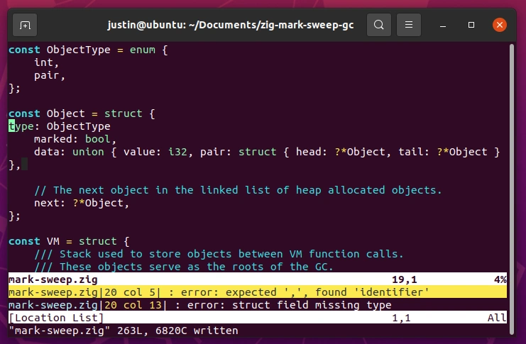

# Porting a simple Mark-Sweep Garbage Collector to Zig

This project is a port of Bob Nystrom's simple mark-sweep garbage collector - a modern classic! - from C to Zig. 

This is my first Zig project. Between that and Zig being a relatively new language I thought it would be helpful to give an overview of the experience and talk about the tooling.

This post explains a few parts of the program but I can't do justice to [Bob's original article](https://journal.stuffwithstuff.com/2013/12/08/babys-first-garbage-collector/) which I highly recommend reading. His C implementation is included as `main.c` in this repo and is available [on GitHub](https://github.com/munificent/mark-sweep).

Anyway, off we go...

## Installing Zig

The installation process is very simple. Just download the latest version from the [Releases page](https://ziglang.org/download/), extract to a folder, and add to your path.

For example here is how Zig is installed for this project's continuous integration: 

```bash
wget https://ziglang.org/download/0.9.1/zig-linux-x86_64-0.9.1.tar.xz
tar xf zig-linux*.tar.xz
echo "`pwd`/zig-linux-x86_64-0.9.1" >> $GITHUB_PATH
```

A real installation would put the files somewhere more appropriate but this works just fine for our CI.

`zig` comes as a large statically-linked executable. No dependencies required :thumbsup:.

## Vim Plugin

Out of the box Vim works well enough as an editor for Zig but the experience is a bit underwhelming. So I installed the [Vim configuration for Zig](https://github.com/ziglang/zig.vim) plugin get syntax highlighting.

As an unexpected bonus:

> This plugin enables automatic code formatting on save by default using `zig fmt`.

Much like with Go its super handy to be able to just *not worry* about code formatting. On top of that `zig fmt` also catches basic syntax errors:



I tend to save frequently when coding so this provides constant feedback on the state of the code.

## Printing

I just used debug printing to write output:

```zig
const print = @import("std").debug.print;
print("Collected {} objects, {} remaining.\n", .{ numObjects - self.numObjects, self.numObjects });
```

An interesting observation is that instead of C varargs Zig uses an [anonymous struct](https://ziglang.org/documentation/master/#Anonymous-List-Literals). 

## While Loops, If's, Optionals, and More

Zig has many improvements over standard C syntax.

Increment as part of the loop:

```zig
while (i < self.stack_size) : (i += 1) {
```

Unbox [optionals](https://ziglang.org/documentation/master/#Optionals):

```zig
while (object.*) |obj| {
if (object.data.pair.head) |head| {
```

Handle [error unions](https://ziglang.org/documentation/master/#Error-Union-Type):

```zig
var a = vm.pushPair() catch unreachable;
```

Other miscellaneous improvements over C include standard naming conventions (underscores in names for non-callable variables) and a cleaner boolean type.

It is also helpful to define functions as part of a `struct` type, allowing a more natural organization of code. Though this has been a standard feature in most languages for a long time now. [Including C++](https://stackoverflow.com/a/13125960/101258).
## Pointers

The `sweep` function uses a pointer-to-pointer to walk the link list of all objects and unlink unused objects:

```c
void sweep(VM* vm)
{
  Object** object = &vm->firstObject;
  while (*object) {
    if (!(*object)->marked) {
      /* This object wasn't reached, so remove it from the list and free it. */
      Object* unreached = *object;

      *object = unreached->next;
      free(unreached);

      vm->numObjects--;
    } else {
      /* This object was reached, so unmark it (for the next GC) and move on to
       the next. */
      (*object)->marked = 0;
      object = &(*object)->next;
    }
  }
}
```

Perhaps surprisingly, this function can be expressed line for line in Zig, just with a fresh new syntax. 

```zig
fn sweep(self: *VM) void {
    var object = &(self.first_object);
    while (object.*) |obj| {
        if (!obj.marked) {
            // This object wasn't reached, so remove it from the list and free it.
            var unreached = obj;

            object.* = obj.next;
            self.allocator.destroy(unreached);

            self.num_objects -= 1;
        } else {
            // This object was reached, so unmark it (for the next GC) and move on to
            // the next.
            obj.marked = false;
            object = &(obj.next);
        }
    }
}
```

## Testing

All of the tests were ported over to [test declarations](https://ziglang.org/documentation/master/#Zig-Test). These can be invoked via `zig test mark-sweep.zig`:

```zig
test "test 1" {
    const allocator = std.testing.allocator;
    print("Test 1: Objects on stack are preserved.\n", .{});

    var _vm = try VM.init(allocator);
    var vm = &_vm;
    try vm.pushInt(1);
    try vm.pushInt(2);

    vm.gc();

    try std.testing.expect(vm.num_objects == 2);
    vm.deinit();
}
```

Another important point! In Zig one does not call `malloc` to allocate memory. Instead one of many allocators is used to allocate memory in the way that is most appropriate for the situation at hand. Our code is organized like a typical library where any allocator may be passed in and retained for memory allocations over the life of a VM instance. 

For testing we use `testing.allocator` which fails the test case if any memory is leaked. This enhances our test as `vm.deinit()` removes all of the [root objects](https://www.memorymanagement.org/glossary/r.html#term-root) and performs a collection. If our code is working properly all allocated memory will be freed.

## Debugging with gdb

Having debugged C extensively `gdb` I was shocked that it *Just Works* for debugging Zig code: 

```shell
justin@ubuntu:~/Documents/zig-mark-sweep-gc$ make
zig build-exe mark-sweep.zig
justin@ubuntu:~/Documents/zig-mark-sweep-gc$ ./mark-sweep 
Performance Test.
Collected 20000 objects, 0 remaining.
justin@ubuntu:~/Documents/zig-mark-sweep-gc$ gdb mark-sweep 
GNU gdb (Ubuntu 9.1-0ubuntu1) 9.1
Copyright (C) 2020 Free Software Foundation, Inc.
License GPLv3+: GNU GPL version 3 or later <http://gnu.org/licenses/gpl.html>
This is free software: you are free to change and redistribute it.
There is NO WARRANTY, to the extent permitted by law.
Type "show copying" and "show warranty" for details.
This GDB was configured as "x86_64-linux-gnu".
Type "show configuration" for configuration details.
For bug reporting instructions, please see:
<http://www.gnu.org/software/gdb/bugs/>.
Find the GDB manual and other documentation resources online at:
    <http://www.gnu.org/software/gdb/documentation/>.

For help, type "help".
Type "apropos word" to search for commands related to "word"...
Reading symbols from mark-sweep...
(gdb) break VM.sweep
Breakpoint 1 at 0x23091c: file /home/justin/Documents/zig-mark-sweep-gc/mark-sweep.zig, line 91.
(gdb) run
Starting program: /home/justin/Documents/zig-mark-sweep-gc/mark-sweep 
Performance Test.

Breakpoint 1, VM.sweep (self=0x7fffffffd938) at /home/justin/Documents/zig-mark-sweep-gc/mark-sweep.zig:91
91              var object = &(self.first_object);
(gdb) n
92              while (object.*) |obj| {
(gdb) 
```

## Conclusion

That's it for now. All in all this was a great first experience with Zig and I look forward to writing more Zig in the near future!

Useful links:

- [Zig Language Reference](https://ziglang.org/documentation/master/)
- [How to read the standard library source code](https://github.com/ziglang/zig/wiki/How-to-read-the-standard-library-source-code)
- [Zig Standard Library Documentation](https://ziglang.org/documentation/master/std/)
- [Zig Tutorial](https://ziglearn.org/)

## what else?

- web assembly compilation (TBD, probably requires a main and possibly a more detailed implementation)

